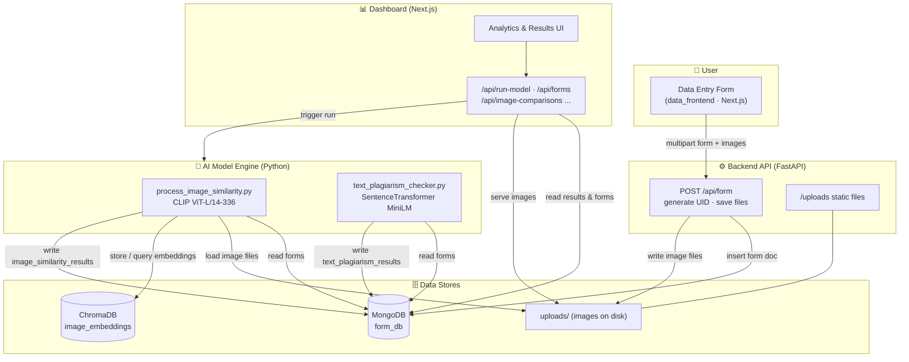

# Similarity Detection for Images and Text

An end-to-end platform for detecting **image similarity** and **text plagiarism** across
Kaizen / Gemba improvement submissions. Users submit a project form with *before* and
*after* pictures, an AI engine compares every image and text field against the others,
and an analytics dashboard visualizes the similarity results.

---

## System Flow Diagram



---

## What It Does

| Capability | How | Threshold |
|------------|-----|-----------|
| **Image similarity** | Embeds every before/after image with OpenAI CLIP (`clip-vit-large-patch14-336`), stores vectors in ChromaDB, and compares them with cosine similarity. | `> 85%` flagged as similar |
| **Text plagiarism** | Encodes the `currentSituation`, `rootCause`, and `actionTaken` fields with `all-MiniLM-L6-v2` and compares each pair per document. | `> 60%` flagged as plagiarism |
| **Data capture** | A public Next.js form posts project metadata + images to the FastAPI backend, which assigns a sequential UID and persists everything to MongoDB. | — |
| **Visualization** | A Next.js dashboard reads results from MongoDB and renders charts, comparison cards, run status, and analytics. | — |

---

## Repository Structure

```
Similarity_detection_image_and_text/
├── data_frontend/      # Next.js — public data-entry form (submits to backend)
│   └── app/form/       #   the submission form
├── backend/            # FastAPI — receives forms, stores images + metadata
│   ├── main.py         #   POST /api/form endpoint, /uploads static mount
│   ├── utils.py        #   sequential UID generator
│   └── uploads/        #   uploaded before/after images
├── ai_model/           # Python — the ML comparison engine
│   ├── main.py         #   entrypoint for the image-similarity run
│   ├── config/db.py    #   MongoDB connection helper
│   ├── services/
│   │   ├── process_image_similarity.py   # CLIP + ChromaDB image matching
│   │   └── text_plagiarism_checker.py    # SentenceTransformer text matching
│   └── chromadb_store/ #   persisted vector store
└── dashboard/          # Next.js — analytics & results dashboard
    └── app/api/        #   route handlers reading MongoDB + triggering runs
```

---

## Architecture Overview

The system has four independent services that share **one MongoDB database** (`form_db`)
and **one image directory** (`backend/uploads/`):

1. **`data_frontend`** — the collection point. Users fill in a Kaizen/Gemba form
   (project name, theme, situation, root cause, action taken, etc.) and upload
   *before* and *after* photos. It posts a `multipart/form-data` request to the backend.

2. **`backend`** (FastAPI) — the ingest API. `POST /api/form`:
   - generates the next sequential `uid` (`utils.generate_uid`),
   - writes each uploaded image to `uploads/` with a timestamped filename,
   - inserts the form document (with image paths) into the `forms` collection.
   - It also serves uploaded images statically at `/uploads`.

3. **`ai_model`** — the offline/triggered comparison engine:
   - **Images:** `ImageSimilarityProcessor` reads every form's image paths, extracts
     normalized CLIP embeddings, stores them in ChromaDB, then queries the store to
     find similar pairs (skipping self-matches and duplicates). Results are written to
     `image_similarity_results`.
   - **Text:** `check_text_plagiarism` encodes the three narrative fields per document
     and compares each pair, writing hits to `text_plagiarism_results`.

4. **`dashboard`** — the read/visualize layer. Its API routes
   (`/api/forms`, `/api/image-comparisons`, `/api/last-run`, `/api/db-status`,
   `/api/run-model`, `/api/uploads/...`) read directly from MongoDB, serve images, and
   can trigger a fresh model run.

### MongoDB collections (`form_db`)

| Collection | Written by | Contents |
|------------|-----------|----------|
| `forms` | backend | Submitted form data + image paths |
| `image_similarity_results` | ai_model | Pairwise image similarity scores |
| `text_plagiarism_results` | ai_model | Pairwise text similarity hits |

---

## Getting Started

### Prerequisites

- Python 3.12+
- Node.js 18+ (with `npm` or `pnpm`)
- A MongoDB instance (local or Atlas)

### 1. Backend (FastAPI)

```bash
cd backend
python -m venv .venv && source .venv/bin/activate
pip install -r requirements.txt

# create .env with your MongoDB connection string
echo "MONGODB_URI=<your-mongodb-uri>" > .env

python main.py            # serves on http://0.0.0.0:8000
```

### 2. AI Model Engine

```bash
cd ai_model
python -m venv .venv && source .venv/bin/activate
pip install -r requirements.txt

# copy example.env and fill in MONGODB_URI
cp example.env .env

python main.py            # runs the image-similarity pipeline
```

> **Note:** `process_image_similarity.py` uses `Config.base_dir` to locate image files.
> Set it to the absolute path of your `backend/` directory (where `uploads/` lives).
> The text checker can be run by importing and calling
> `check_text_plagiarism(db)` with a live DB handle.

### 3. Data Entry Frontend

```bash
cd data_frontend
npm install
# point app/config/config.ts BACKEND_URL at your backend
npm run dev               # http://localhost:3000
```

### 4. Dashboard

```bash
cd dashboard
npm install               # or: pnpm install
cp example.env .env       # set MONGODB_URI and NEXT_PUBLIC_IMAGE_ENDPOINT
npm run dev
```

---

## Environment Variables

| Service | Variable | Purpose |
|---------|----------|---------|
| backend | `MONGODB_URI` | MongoDB connection string |
| ai_model | `MONGODB_URI` | MongoDB connection string |
| dashboard | `MONGODB_URI` | MongoDB connection string |
| dashboard | `NEXT_PUBLIC_IMAGE_ENDPOINT` | Base URL for serving uploaded images |
| data_frontend | `BACKEND_URL` (in `app/config/config.ts`) | Backend API base URL |

---

## Tech Stack

- **Frontend:** Next.js, React, Tailwind CSS, Radix UI, Recharts
- **Backend:** FastAPI, Uvicorn, PyMongo
- **AI / ML:** PyTorch, Hugging Face Transformers (CLIP), Sentence-Transformers, scikit-learn
- **Vector store:** ChromaDB (with a FAISS index also present)
- **Database:** MongoDB

---

## Typical Workflow

1. A user submits the improvement form with before/after photos → stored via the backend.
2. Run the AI engine (`ai_model/main.py` or the dashboard's **Run Model** action).
3. The engine embeds images + text and writes similarity/plagiarism results to MongoDB.
4. Open the dashboard to review flagged pairs, scores, trends, and analytics.
```
